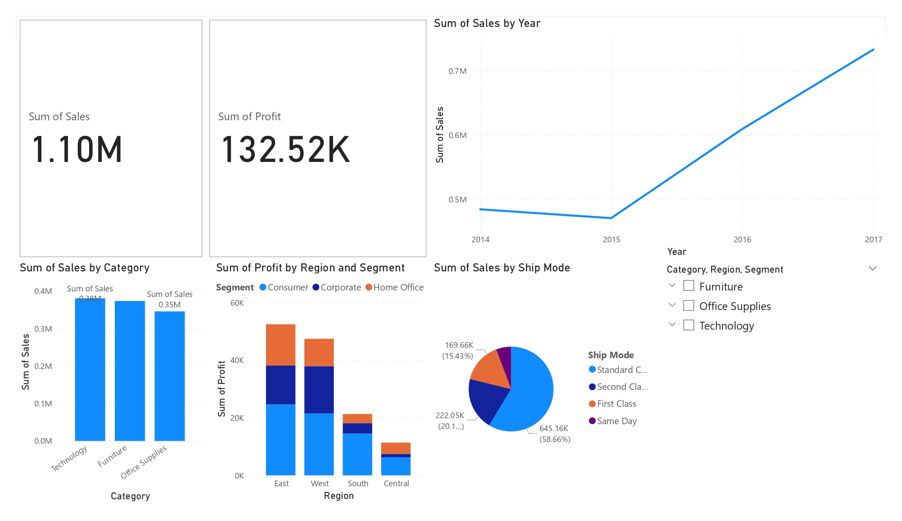
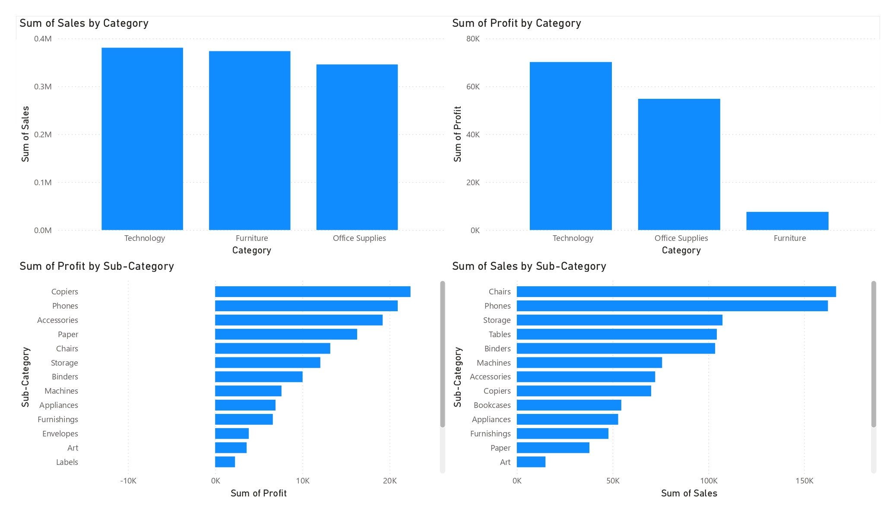
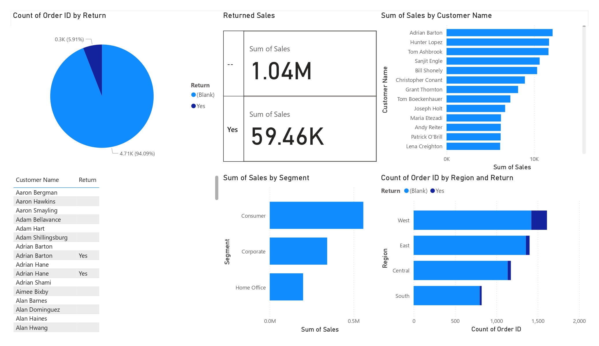

# 📊 Power BI – Superstore Sales Analysis

This project presents a detailed Power BI dashboard built using the Sample Superstore dataset. It focuses on sales, profit, returns, categories, customer segments, and sub-category performance across different years and regions.

---

## 📁 Dataset

- **Source**: Sample Superstore dataset
- **Tables Used**:
  - `Orders`
  - `Returns`
  - `People` (optional)

---

## 🚀 Project Highlights

- Multi-page Power BI dashboard with consistent design
- Analysis of sales and profit by category, sub-category, region, and year
- Customer-wise performance breakdown
- Return order tracking by customer and region
- Return rate and returned sales volume
- Created calculated columns and DAX logic to handle returned vs non-returned orders

---

## 📄 Report Pages & Visuals

### 🔹 Page 1: Overview
- Sales by Category (Bar Chart)
- Sales by Year (Line Chart)
- Sales by Ship Mode (Bar Chart)
- Profit by Region and Segment

### 🔹 Page 2: Category & Sub-Category Insights
- Sales by Sub-Category (Bar Chart)
- Profit by Sub-Category (Bar Chart)
- Sales and Profit by Category (Clustered Bar Chart)
- Profit by Category

### 🔹 Page 3: Customer and Returns Analysis
- Sales by Customer Name (Bar Chart)
- Sales by Segment
- Return Status Count (Pie or Bar Chart)
- Return by Region (Stacked Column)
- Returned vs Not Returned Customer Orders
- Returned Sales Value

### 🔹 Page 4: Trend and Comparison Insights
- Sales and Profit by Category (Clustered Column)
- Sales by Region
- Profit by Sub-Category
- Sales by Year (Trend Line)

---

## 🛠 Tools Used

- Power BI Desktop
- Microsoft Excel
- DAX (Data Analysis Expressions)

---

## 🖼 Screenshots

| Overview Page | Category Analysis | Customer Returns |
|---------------|-------------------|------------------|
|  |  |  |

---

## 📂 How to Use

1. Clone or download the repository
2. Open the `.pbix` file using Power BI Desktop
3. Explore visuals and filters to analyze insights

---

## 👨‍🎓 Author

**Sanjeev D**  
Final Year B.Tech – Artificial Intelligence & Data Science  
GitHub: [@SANJEEV-00](https://github.com/SANJEEV-00)

---

## 📬 Contact

Feel free to open an issue for suggestions or feedback.

---

## 📄 License

This project is licensed under the [MIT License](LICENSE).
